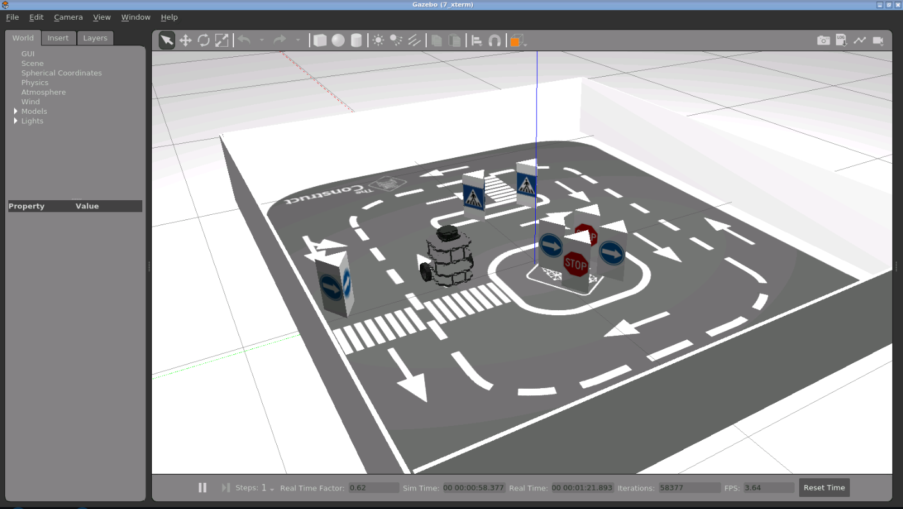

# A Basic ROS Package

A ROS package (using rospy) to test basic ROS functionality such as topics, messages, services and actions. The package contains three nodes. An action server, a service server and a control node. The service and action use custom messages included in the package. This is a solution to the ROS Basics Project by [The Construct](https://www.theconstructsim.com/).

## Installation and Usage

Paste the trial_package folder in your catkin_ws/src directory. Then,

```bash
cd ~/catkin_ws/
catkin build
```

## Description

Though the package may build successfully, it requires a simulation to be running on gazebo to function. (As it uses various topics such as /odom, /cmd_vel etc). The package can however serve as an example on how to use topics, services and actions using rospy.

- ``action_server.py`` : An action server that computes the distance travelled by the robot using /odom topic. Also maintains a record of the robot's pose (x, y, thetha)
- ``find_wall_server.py`` : A service server that makes the robot move towards the nearest wall. Uses /scan to get laser-scanner readings and moves the bot using /cmd_vel
- ``wall_follow.py`` : The main control node that calls the action and service server before setting the robot on a wall-following motion
- ``trial_package.launch`` : A simple launch file to launch the above mentioned nodes

